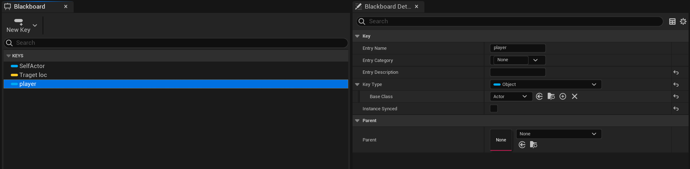
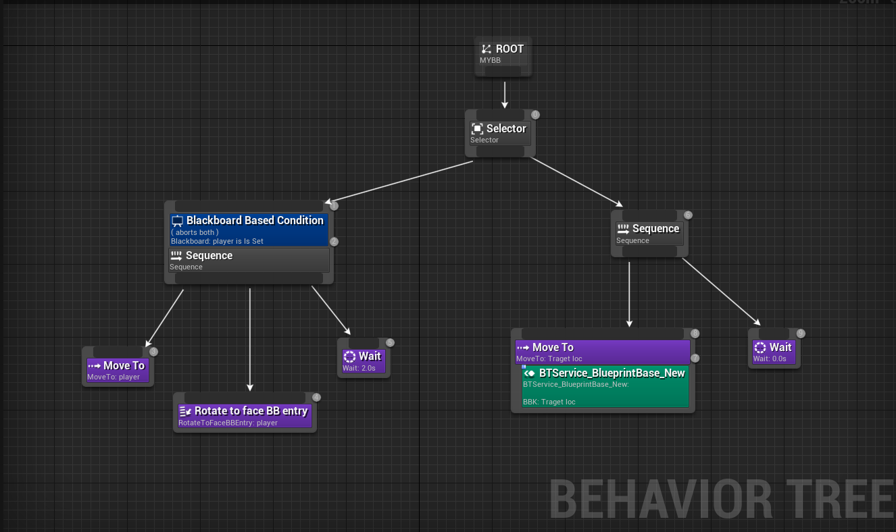
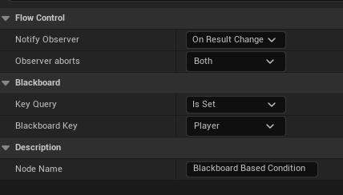
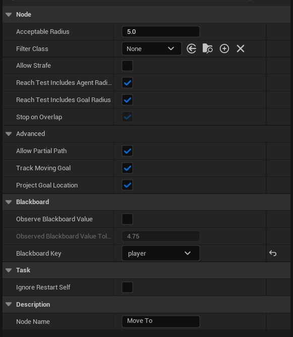
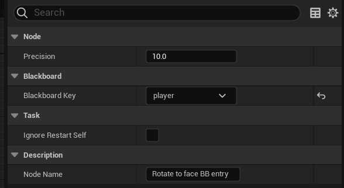
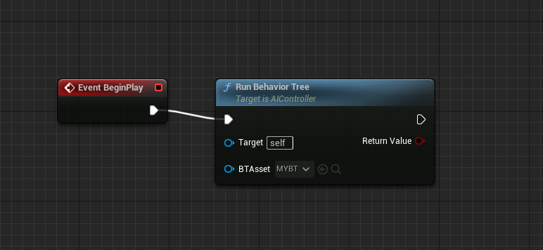
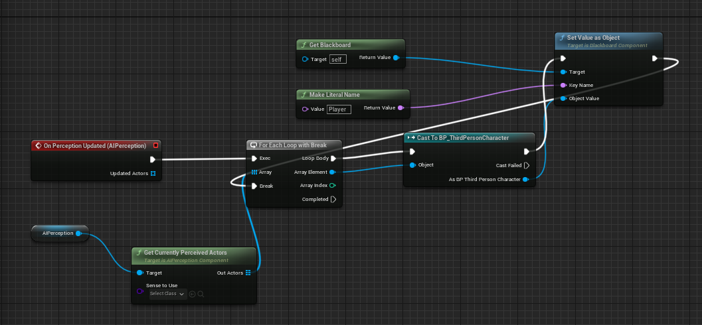
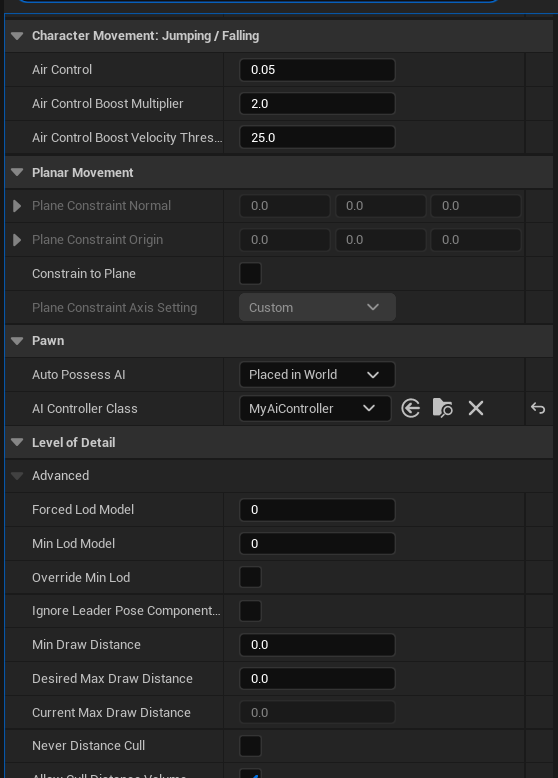
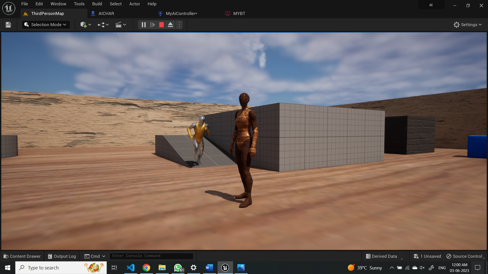

# EXP-07-AI-CHASING

## AIM:
To implementchasing when AI see the player.

## ALGORITHM:
### STEP-1: 
Set up the AI character Blueprint:

    Create an AI character Blueprint (if you haven't already) following the steps mentioned earlier.
    Add a Sphere Collision component to the AI character Blueprint.
    Position and scale the Sphere Collision component to represent the AI's detection range.
    Set the Sphere Collision component's collision settings to overlap with the player character.
### STEP-2: 
Create a new AI controller Blueprint:

    In the Content Browser, right-click in the desired folder.
    Select Create Basic Asset > Blueprint Class.
    Choose the AIController as the parent class.
    Name the Blueprint (e.g., "AIController_Chase") and click Create.
### STEP-3: 
Open the AIController Blueprint:

    In the Blueprint editor, locate the Event Begin Play event.
    Drag off the execution line and search for "Set Sight Radius".
    Set the Sight Radius value to the desired range for the AI's vision.
    Drag off the execution line again and search for "Set Peripheral Vision Angle".
    Set the Peripheral Vision Angle value to the desired field of view for the AI's vision.
### STEP-4: 
Implement perception for the AI:

    Drag off the execution line in the Begin Play event and search for "Create and Configure AI Perception Component".
    Connect the output of the AI Perception Component node to the AI Controller's AI Perception property.
    In the AI Perception Component node, configure the settings for sight and sight sense.
    Drag off the AI Perception Component node and search for "Update Perception".
    Connect the output of the Update Perception node to the Event Tick event.
    In the Update Perception node, select "Sight" as the stimulus to update.
    Connect the output of the AI Perception Component to a "For Each Loop" node to iterate through all perceived stimuli.
### STEP-5: 
Implement the chase behavior:

    Inside the For Each Loop, check if the perceived stimulus is the player character.
    If the stimulus is the player character, drag off the execution line and search for "Move To Actor".
    Set the Move To Actor node's target to the player character.
    Connect the output of the Move To Actor node to the AI Controller's Move To Location input.
### STEP-6: 
Create blackboard keys for the AI:

    Open the AIController Blueprint.
    In the Blueprint editor, locate the Event Begin Play event.
    Drag off the execution line and search for "Create Blackboard".
    Create a new blackboard object and assign it to the AIController's Blackboard property.
    Drag off the execution line again and search for "Create Blackboard Key".
    Create a new key for the blackboard, such as "PlayerLocation".
    Connect the output of the Create Blackboard Key node to the AIController's Blackboard property.
### STEP-7: 
Update blackboard values:

    In the AIController Blueprint, find the Event Tick event.
    Drag off the execution line and search for "Get Player Character".
    Drag off the player character reference and search for "Get Actor Location".
    Connect the output of the Get Actor Location node to the AIController's Set Blackboard Value As Vector input.
    Set the Blackboard Key to the "PlayerLocation" key you created earlier.
### STEP-8: 
Set up the Behavior Tree:

    Create a Behavior Tree asset following the steps mentioned earlier.
    Open the Behavior Tree asset in the Behavior Tree editor.
    Drag and drop a "Blackboard Key Selector" node onto the graph.
    Configure the Blackboard Key Selector node to use the "PlayerLocation" key

## OUTPUT:
### BLACKBOARD KEY CREATION:

### BEHAVIOR TREE:

### SETTING PLAYER KEY SEQUENCE NODE:

### ETTING PLAYER KEY TO MOVETO NODE:

### SETTING PLAYER KEY TO BB ROTATE NODE:

### ADDING AI PERCEPTION NODE:

### AI CONTROLLER GRAPH:

### AI CONTROLLER CLASS SELECTION:

### AI SENCE CONFIG:

### GAME MODE:

## RESULT: 
Thus, AI concept to actor for a chasing when AI see the player.